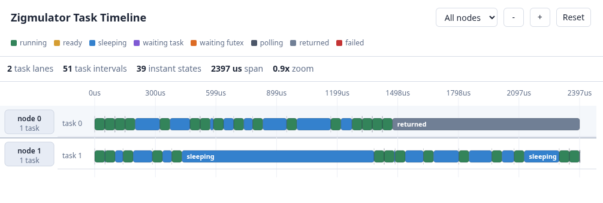

# Zigmulator

Zigmulator is an experimental Deterministic Simulation Testing framework for Zig 0.16

It allows you to run one or more zig programs in a controlled environment with the ability to inject arbitrary I/O faults. The zigmulation is fully deterministic, which allows you to replay any scenario. It's ideal for testing distributed systems where bugs lay in the interleavings of different nodes. You can learn more about DST [here](DST.md).

# Getting Started

## Add Zigmulator To A Project

Add Zigmulator as a package dependency in your project's `build.zig.zon`.
For a local checkout:

```zig
.dependencies = .{
    .zigmulator = .{
        .path = "../Zigmulator",
    },
},
```

For a remote dependency, use `zig fetch --save <url>` and let Zig add the
URL and hash to `build.zig.zon`.

Then expose the module to your simulation driver from `build.zig`:

```zig
const target = b.standardTargetOptions(.{});
const optimize = b.standardOptimizeOption(.{});

const zigmulator_dep = b.dependency("zigmulator", .{
    .target = target,
    .optimize = optimize,
});

const simulation = b.addExecutable(.{
    .name = "simulate",
    .root_module = b.createModule(.{
        .root_source_file = b.path("simulation.zig"),
        .target = target,
        .optimize = optimize,
    }),
});
simulation.root_module.addImport("zigmulator", zigmulator_dep.module("zigmulator"));

const run_simulation = b.addRunArtifact(simulation);
const simulate_step = b.step("simulate", "Run the deterministic simulation");
simulate_step.dependOn(&run_simulation.step);
```

To run your program in Zigmulator, you need to create a driver program that imports your main() functions and plugs them in a simulator.

```zig
const std = @import("std");
const Io = std.Io;

const Simulator = @import("zigmulator");

// Import entry points of the programs to simulate.
// 
// The expected interface is:
//     pub fn main(init: std.process.Init) anyerror!void
// 
const programA = @import("projectA/main.zig").main;
const programB = @import("projectB/main.zig").main;
const programC = @import("projectC/main.zig").main;

pub fn main(init: std.process.Init) !void {

    var sim: Simulator = undefined;
    sim.init(std.heap.page_allocator, init.io, 0);
    defer sim.deinit();

    // Associate executable names to zig entry functions
    try sim.addExecutable("program_a", programA);
    try sim.addExecutable("program_b", programB);
    try sim.addExecutable("program_c", programC);

    // Now run commands in the form:
    //     program_name arg1 arg2 arg3 ...
    // where program_name is one of the registered functions.
    try sim.spawn("program_a", .{});
    try sim.spawn("program_b", .{});
    try sim.spawn("program_c", .{});

    // Advance the cluster's state by advancing the program's
    // states one by one. Exits when all programs have returned
    // or failed.
    while (sim.scheduleOne()) {}

    std.debug.print("Simulation ended\n", .{});
}
```

## How it Works

Zigmulator implements an in-memory kernel, disk, network and plugs it into your application via the new IO interface (since Zig 0.16). Multiple programs can run in the same simulation, in which case network traffic is routed between their mocks. This is a bruteforce approach but the only one that allows a complete control of the environment the applications are running in.

To avoid non-determinism of kernel-level scheduling, all simulated programs run in a single kernel thread and are scheduled in userspace. Any time a program performs an I/O operation, it yields to a different program.

## Limitations

Since Zigmulator mocks the entire world, the main limitation is in how much of it is mocked and how it differs from the real implementation. This project takes a best-effort approach: the model of the external world is simplified, and applications tested with Zigmulator are expected to only rely on functionality that is mocked. For instance, in the Zigmulator model, each process owns its own machine. If you spawn multiple nodes, each will have its own NIC and disk.

Adapting mature projects to DST frameworks is a generally hard thing. For new project it's a good idea to develop inside Zigmulator to only rely on available features and then test the project on real hardware as a sanity check.

## Current Status

Currently Zigmulator implements mocks for the most common functions of `std.Io` like file system operations, network operations, asynchronous tasks. Concurrent tasks and process management are considered out of scope.

## Visualization

You can also use the simulation trace to create visualizations of what your program is doing. This is still work-in-progress, but here's a timeline diagram I created the other day:


